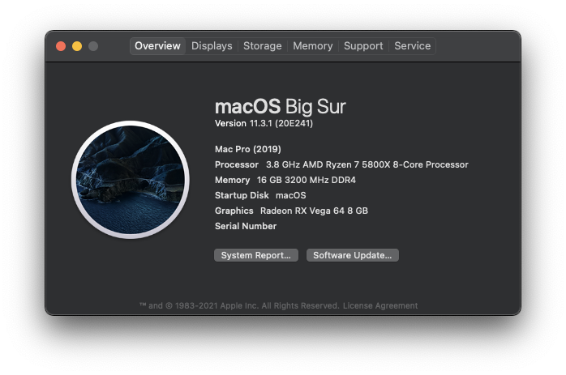

⚠️ <b>OpenCore is still in beta. Please keep this in mind.</b>

**macOS Big Sur**: 11.2.3 (20D91) Dual Boot w/ **Windows 10**: 2004

**OpenCore version**: 0.6.6  

 

## My System
| **Component** | **Model** |
| ------------- | --------- |
| CPU | AMD Ryzen 7 5800x @ 3.8GHz |
| Motherboard | ASUS ROG Strix B450-F Gaming |
| GPU | Vega 64 Limited Edition |
| RAM | 16GB @ 3200MHz |
| WIFI + BT| BCM94360NG |

 

## Installation Details

### Software Needed
1. gibMacOS: https://github.com/corpnewt/gibMacOS
2. GenSMBIOS: https://github.com/corpnewt/GenSMBIOS 
3. MountEFI: https://github.com/corpnewt/MountEFI
4. ProperTree: https://github.com/corpnewt/ProperTree
5. USB Map: https://github.com/corpnewt/USBMap
6. OpenCore Sanity Checker: https://opencore.slowgeek.com/

### BIOS Settings
- Fast Boot → Disabled
- Launch CSM → Disabled
- Secure Boot → Other OS
- Serial Port → Disabled
- XHCI Hand-off → Enabled
- Core Performance Boost → Enabled

### Recommended Software
1. [AMD Power Gadget](https://github.com/trulyspinach/SMCAMDProcessor/releases): To read and adjust CPU clock frequencies
2. [SteelSeries ExactMouse Tool](https://downloads.steelseriescdn.com/drivers/tools/steelseries-exactmouse-tool.dmg): To disable mouse acceleration within macOS 
3. [MOS](https://mos.caldis.me/): To enable smooth scrolling on normal mice

### Kexts Used
1. [AMDRyzenCPUPowerManagement](https://github.com/trulyspinach/SMCAMDProcessor)
2. [AppleALC](https://github.com/acidanthera/AppleALC)
3. AppleMCEReporterDisabler
4. [Lilu](https://github.com/acidanthera/Lilu)
5. [NVMeFix](https://github.com/acidanthera/NVMeFix)
6. [SmallTreeIntel82576](https://github.com/khronokernel/SmallTree-I211-AT-patch)
7. [SMCAMDProcessor](https://github.com/trulyspinach/SMCAMDProcessor)
8. [VirtualSMC](https://github.com/acidanthera/virtualsmc)
9. [WhateverGreen](https://github.com/acidanthera/whatevergreen)
10. [USBMap](https://github.com/corpnewt/USBMap)

### What Works
- Pretty much everything!
- Safari DRM
- Hardware Acceleration (via Vega 64 GPU)
- Sleep 
- System Performance Monitoring (via `AMDRyzenCPUPowerManagement` and `SMCAMDProcessor`)
- Continunity and Handoff (BCM94360NG)
- USB Port mapping

### What Doesnt Work
- Sidecar (because of AMD CPU)
- Adobe Products (can be fixed)
- Docker ([VirtualBox](https://medium.com/crowdbotics/a-complete-one-by-one-guide-to-install-docker-on-your-mac-os-using-homebrew-e818eb4cfc3) can be used)
- Discord (fix can be found in `/Tools`)

 

## Notes
- A custom usb map was made to prevent going over the 15-port usb limit within macOS
  - This map may not work correctly with your system - see [here](https://github.com/corpnewt/USBMap) to create another one
    - Alternatively, you can remove the `USBMap.kext` kext
  - Currently all motherboard IO USB ports are mapped (except for the one beside the USB C port) as well as two USB 3 ports on my [case](https://www.fractal-design.com/products/cases/meshify/meshify-c-dark-tempered-glass/Black/) 

 

## Special Thanks
- Thanks to [@willza3](https://github.com/willza3/macOS-strix-B450i) and [@Mattis-Schulte](https://github.com/Mattis-Schulte/hackintosh-asus-b450f) for providing starting configurations for this motherboard! 